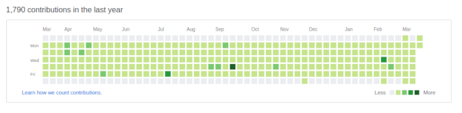

# hub-fooler

Create superstar repositories.

## Usage

Fork the hub-fooler repo, run the fooler script, then push the fooler repo's master branch to a master branch in a github repo:

```
  ./hub-fooler.sh
  git -C ${hub_fooler_tmp_dir}/repo push git@github.com:${user}/fooler-out.git master
  rm -rf ${hub_fooler_tmp_dir}
```

To cleanup remove the remote github branch:

```
  git push git@github.com:${user}/fooler-out.git :master
```

## Usage

```
hub-fooler.sh - Generate a superstar git repository.
Usage: hub-fooler.sh [flags]
Option flags:
  -h --help        - Show this help and exit.
  -v --verbose     - Verbose execution.
  -g --debug       - Extra verbose execution.
Level:
  -1 --light-weight - One commit every few days.
  -2 --rock-star    - One commit per day, M-F (default).
  -3 --hero         - One-three commits per day, M-F.
  -4 --untouchable  - Two-five commits per day, everyday.
Info:
  Project Home: https://github.com/glevand/hub-fooler
```

## Results



## License

All files in the [hub-fooler project](https://github.com/glevand/hub-fooler), unless otherwise noted, are covered by an [MIT Plus License](https://github.com/glevand/hub-fooler/blob/master/mit-plus-license.txt).  The text of the license describes what usage is allowed.


